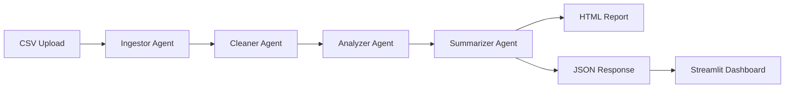

# 🔍 InsightMesh - AI-Powered Data Analysis Platform

> **Enterprise-grade data insights powered by Google Agentic ADK Framework**

InsightMesh is a sophisticated data analysis platform that leverages Google's Agentic ADK framework to provide comprehensive CSV data analysis through an intelligent multi-agent pipeline. The system generates professional HTML reports and provides API endpoints optimized for building interactive Streamlit dashboards.

## 🎯 Key Features

- **🤖 Google ADK Integration**: Powered by Google's Agentic ADK framework
- **🔄 Multi-Agent Pipeline**: Intelligent data processing through specialized agents
- **📊 Professional Reports**: Auto-generated HTML reports with business insights
- **🚀 FastAPI Backend**: RESTful API optimized for frontend integration
- **📈 Streamlit Ready**: API responses designed for dashboard visualization
- **🎨 Beautiful UI**: Professional HTML reports with responsive design
- **⚡ Real-time Processing**: Live agent execution with detailed logging

## 🏗️ Architecture Overview

### Google ADK Agent Pipeline



### System Components

```
📦 InsightMesh Backend
├── 🤖 Google ADK Agents
│   ├── 📥 Ingestor Agent - CSV loading & parsing
│   ├── 🧹 Cleaner Agent - Data quality analysis
│   ├── 📊 Analyzer Agent - Statistical analysis
│   └── 📝 Summarizer Agent - LLM-powered insights
├── 🚀 FastAPI Server - RESTful API endpoints
├── 📄 HTML Generator - Professional report creation
├── 🗄️ Report Storage - Persistent report management
└── 📡 Streamlit Integration - Dashboard-ready responses
```

## 🚀 Quick Start

### Prerequisites

```bash
# Python 3.8+
# Google ADK Framework
# FastAPI & dependencies
```

### Installation

```bash
# Clone the repository
git clone <repository-url>
cd insightmesh_backend

# Install dependencies
pip install -r requirements.txt

# Set up environment variables
export GOOGLE_API_KEY="your-gemini-api-key"

# Start the FastAPI server
python main.py
# or
uvicorn main:app --reload --host 0.0.0.0 --port 8000
```

### Quick Test

```bash
# Test with sample data
curl -X POST "http://localhost:8000/analyze" \
  -H "Content-Type: multipart/form-data" \
  -F "file=@sample_data/sample_sales_data.csv"
```

## 📡 FastAPI Routes Reference

### 🔍 Data Analysis Endpoints

#### `POST /analyze`
**Main analysis endpoint - Upload CSV and get comprehensive insights**

```python
# Request
POST /analyze
Content-Type: multipart/form-data
Body: file (CSV file)

# Response
{
  "success": true,
  "message": "Successfully analyzed filename.csv using Google ADK agents",
  "insights": {
    "framework": "Google Agentic ADK",
    "pipeline_execution": "completed",
    "data_info": {
      "filename": "sample.csv",
      "rows": 1000,
      "columns": 8,
      "column_names": ["Date", "Product", "Revenue", ...]
    },
    "cleaning_info": {
      "null_summary": {"Date": 0, "Product": 2, ...},
      "suggestions": ["Fill missing values in Product"]
    },
    "analysis_results": {
      "Revenue": {
        "count": 1000,
        "mean": 2500.50,
        "std": 450.25,
        "min": 1200.00,
        "max": 4500.00
      }
    },
    "html_report": {
      "report_id": "sample_20250623_190858",
      "report_url": "/reports/sample_20250623_190858"
    }
  },
  "summary": "LLM-generated business insights...",
  "processing_steps": [
    {
      "step": "ingestor",
      "agent": "ingestor",
      "status": "completed",
      "output": {"num_rows": 1000, "num_columns": 8}
    }
  ]
}
```

#### `POST /agents/run-pipeline`
**Alternative pipeline execution endpoint**

```python
# Same as /analyze - provided for semantic clarity
POST /agents/run-pipeline
```

### 🤖 Agent Management Endpoints

#### `GET /agents/status`
**Get status of all Google ADK agents**

```python
# Response
{
  "agents": [
    {
      "agent_name": "ingestor",
      "status": "ready",
      "description": "Loads a CSV file into a DataFrame"
    },
    {
      "agent_name": "cleaner",
      "status": "ready", 
      "description": "Detects missing values and provides cleaning suggestions"
    }
  ],
  "total_agents": 4
}
```

#### `GET /agents/{agent_name}/info`
**Get detailed information about a specific agent**

```python
# Response
{
  "name": "ingestor",
  "description": "Loads a CSV file into a DataFrame",
  "model": "Not specified",
  "tools": ["FunctionTool"],
  "status": "ready"
}
```

### 📄 Report Management Endpoints

#### `GET /reports`
**List all available HTML reports**

```python
# Response
{
  "reports": [
    {
      "report_id": "sample_20250623_190858",
      "filename": "sample_20250623_190858.html",
      "created_at": "2025-06-23T19:08:58.317400",
      "size_bytes": 19419,
      "view_url": "/reports/sample_20250623_190858"
    }
  ],
  "total": 1,
  "message": "Found 1 analysis reports"
}
```

#### `GET /reports/{report_id}`
**View HTML report in browser**

```python
# Returns: HTML content (rendered in browser)
Content-Type: text/html
```

#### `GET /reports/{report_id}/download`
**Download HTML report as file**

```python
# Returns: File download
Content-Type: text/html
Content-Disposition: attachment; filename="insightmesh_report_{report_id}.html"
```

#### `DELETE /reports/{report_id}`
**Delete a specific report**

```python
# Response
{
  "message": "Report 'sample_20250623_190858' deleted successfully"
}
```

### 🏥 Health & Monitoring

#### `GET /health`
**System health check**

```python
# Response
{
  "status": "healthy",
  "framework": "Google Agentic ADK",
  "agents_count": 4,
  "agents": ["ingestor", "cleaner", "analyzer", "summarizer"]
}
```

#### `GET /`
**Root endpoint**

```python
# Response
{
  "message": "Welcome to InsightMesh API - Powered by Google Agentic ADK Framework"
}
```

## 🔄 Data Flow & Processing Pipeline

### 1. **Data Ingestion** (`ingestor_agent`)
```python
# Input: CSV file path
# Output: 
{
  "dataframe": pandas.DataFrame,
  "filename": "sample.csv",
  "num_rows": 1000,
  "num_columns": 8,
  "column_names": ["Date", "Product", ...]
}
```

### 2. **Data Cleaning** (`cleaner_agent`)
```python
# Input: pandas.DataFrame
# Output:
{
  "null_summary": {"Date": 0, "Product": 2},
  "suggestions": ["Fill missing values in Product"]
}
```

### 3. **Statistical Analysis** (`analyzer_agent`)
```python
# Input: pandas.DataFrame
# Output:
{
  "numeric_summary": {
    "Revenue": {
      "count": 1000, "mean": 2500.50, "std": 450.25,
      "min": 1200.00, "25%": 2100.00, "50%": 2450.00,
      "75%": 2800.00, "max": 4500.00
    }
  }
}
```

### 4. **LLM Summarization** (`summarizer_agent`)
```python
# Input: numeric_summary, cleaned_data
# Output:
{
  "summary_text": "Business analyst insights generated by Gemini LLM..."
}
```

## 📊 Streamlit Frontend Integration

### API Integration Pattern

```python
import streamlit as st
import requests
import pandas as pd
import plotly.express as px

# File upload
uploaded_file = st.file_uploader("Upload CSV", type=['csv'])

if uploaded_file:
    # Call InsightMesh API
    response = requests.post(
        "http://localhost:8000/analyze",
        files={"file": uploaded_file}
    )
    
    if response.status_code == 200:
        data = response.json()
        
        # Extract data for visualization
        insights = data["insights"]
        data_info = insights["data_info"]
        analysis_results = insights["analysis_results"]
        
        # Build dashboard components
        st.metric("Total Rows", data_info["rows"])
        st.metric("Total Columns", data_info["columns"])
        
        # Statistical visualizations
        for column, stats in analysis_results.items():
            if stats.get("mean"):  # Numeric column
                st.subheader(f"📊 {column} Analysis")
                
                # Create metrics
                col1, col2, col3 = st.columns(3)
                col1.metric("Mean", f"{stats['mean']:.2f}")
                col2.metric("Std Dev", f"{stats['std']:.2f}")
                col3.metric("Range", f"{stats['min']:.0f} - {stats['max']:.0f}")
                
                # Create distribution chart
                # (You would need the raw data for this - consider adding data preview endpoint)
        
        # Display LLM insights
        st.subheader("🤖 AI-Generated Insights")
        st.write(data["summary"])
        
        # Show processing pipeline
        st.subheader("⚙️ Processing Pipeline")
        for step in data["processing_steps"]:
            status_icon = "✅" if step["status"] == "completed" else "❌"
            st.write(f"{status_icon} **{step['step'].title()}**: {step['description']}")
        
        # Link to HTML report
        if "html_report" in insights:
            report_url = f"http://localhost:8000{insights['html_report']['report_url']}"
            st.markdown(f"📄 [View Detailed HTML Report]({report_url})")
```

### Dashboard Components Mapping

| **Streamlit Component** | **API Response Field** | **Usage** |
|------------------------|------------------------|-----------|
| `st.metric()` | `insights.data_info.rows` | Display data size |
| `st.plotly_chart()` | `insights.analysis_results` | Statistical charts |
| `st.write()` | `summary` | LLM insights |
| `st.progress()` | `processing_steps` | Pipeline progress |
| `st.dataframe()` | Custom endpoint needed | Data preview |
| `st.download_button()` | `insights.html_report.report_url` | Report download |

### Recommended Streamlit Pages

```python
# 📊 Main Dashboard
- File upload
- Key metrics display
- Statistical visualizations
- AI insights panel

# 📈 Advanced Analytics  
- Detailed statistical analysis
- Interactive charts
- Correlation analysis
- Trend identification

# 📄 Reports Manager
- List all generated reports
- View/download reports
- Report comparison
- Export options

# ⚙️ System Monitor
- Agent status display
- Processing pipeline health
- Performance metrics
- Error logs
```

## 🛠️ Development Setup

### Project Structure

```
📦 insightmesh_backend/
├── 📁 sub_agents/           # Google ADK Agents
│   ├── 📁 ingestor/         # CSV loading agent
│   ├── 📁 cleaner/          # Data cleaning agent  
│   ├── 📁 analyzer/         # Statistical analysis agent
│   └── 📁 summarizer/       # LLM summarization agent
├── 📁 root_agent/           # Main orchestrator agent
├── 📁 utils/                # Utilities
│   ├── html_report_generator.py  # HTML report creation
│   └── llm_client.py        # LLM integration
├── 📁 schemas/              # Pydantic models
├── 📁 output/               # Generated HTML reports
├── 📁 sample_data/          # Test data
├── main.py                  # FastAPI application
├── agent_plan.py            # Agent orchestration
└── requirements.txt         # Dependencies
```

### Key Dependencies

```txt
fastapi>=0.104.0
uvicorn[standard]>=0.24.0
pydantic>=2.0.0
pandas>=2.0.0
python-multipart>=0.0.6
google-adk>=0.1.6
litellm>=1.25.0
google-generativeai>=0.8.5
```

### Environment Variables

```bash
# Required
GOOGLE_API_KEY=your_gemini_api_key_here

# Optional
LOG_LEVEL=INFO
MAX_FILE_SIZE=10MB
REPORT_RETENTION_DAYS=30
```

## 📈 Example Usage Scenarios

### 1. Sales Data Analysis

```bash
# Upload sales CSV
curl -X POST "http://localhost:8000/analyze" \
  -F "file=@sales_data.csv"

# Expected insights:
# - Revenue trends and patterns
# - Product performance analysis  
# - Regional sales distribution
# - Seasonal variations
# - LLM-generated business recommendations
```

### 2. Customer Data Analysis

```bash
# Upload customer CSV
curl -X POST "http://localhost:8000/analyze" \
  -F "file=@customer_data.csv"

# Expected insights:
# - Customer segmentation
# - Behavior patterns
# - Demographic analysis
# - Churn indicators
# - Retention strategies
```

### 3. Financial Data Analysis

```bash
# Upload financial CSV
curl -X POST "http://localhost:8000/analyze" \
  -F "file=@financial_data.csv"

# Expected insights:
# - Financial performance metrics
# - Cost analysis
# - Profit margin trends
# - Budget variance analysis
# - Investment recommendations
```

## 🎨 HTML Report Features

### Report Sections

1. **📊 Executive Summary**
   - LLM-generated business insights
   - Key findings and recommendations
   - Professional formatting

2. **📋 Data Overview**
   - Visual stat cards (rows, columns, fields)
   - File information
   - Column listing

3. **⚙️ Processing Pipeline**
   - Agent execution status
   - Step-by-step outputs
   - Performance metrics

4. **🧹 Data Quality Analysis**
   - Missing values analysis
   - Data cleaning suggestions
   - Quality score

5. **📈 Statistical Analysis**
   - Detailed metrics per column
   - Distribution analysis
   - Summary statistics

6. **🔍 Technical Details**
   - Raw JSON data (expandable)
   - Processing logs
   - System information

### Report Styling

- **Responsive Design**: Works on desktop, tablet, mobile
- **Professional Branding**: Google ADK themed
- **Interactive Elements**: Expandable sections, hover effects
- **Print-Friendly**: Optimized for PDF export
- **Accessibility**: WCAG compliant design

## 🔧 Configuration & Deployment

### Production Deployment

```bash
# Using Docker
docker build -t insightmesh-backend .
docker run -p 8000:8000 -e GOOGLE_API_KEY=your_key insightmesh-backend

# Using systemd
sudo systemctl enable insightmesh
sudo systemctl start insightmesh

# Using PM2
pm2 start main.py --name insightmesh --interpreter python3
```

### Performance Tuning

```python
# main.py configuration
app = FastAPI(
    title="InsightMesh API",
    docs_url="/docs",
    redoc_url="/redoc",
    openapi_url="/openapi.json"
)

# Production settings
if __name__ == "__main__":
    uvicorn.run(
        app, 
        host="0.0.0.0", 
        port=8000,
        workers=4,  # Adjust based on CPU cores
        log_level="info"
    )
```

### Monitoring & Logging

```python
# Enhanced logging setup
import logging
logging.basicConfig(
    level=logging.INFO,
    format="%(asctime)s - %(name)s - %(levelname)s - %(message)s",
    handlers=[
        logging.FileHandler("insightmesh.log"),
        logging.StreamHandler()
    ]
)
```

## 🚀 API Documentation

- **Interactive Docs**: http://localhost:8000/docs
- **ReDoc**: http://localhost:8000/redoc
- **OpenAPI Spec**: http://localhost:8000/openapi.json

## 🤝 Contributing

1. Fork the repository
2. Create feature branch (`git checkout -b feature/amazing-feature`)
3. Commit changes (`git commit -m 'Add amazing feature'`)
4. Push to branch (`git push origin feature/amazing-feature`)
5. Open Pull Request

## 📄 License

This project is licensed under the MIT License - see the LICENSE file for details.

## 🙏 Acknowledgments

- **Google ADK Team** - For the powerful Agentic framework
- **FastAPI** - For the excellent web framework
- **Streamlit** - For enabling beautiful data applications
- **Gemini AI** - For intelligent text generation

---

**Built with ❤️ for the Google ADK Hackathon**

> Transform your data into actionable insights with AI-powered analysis
